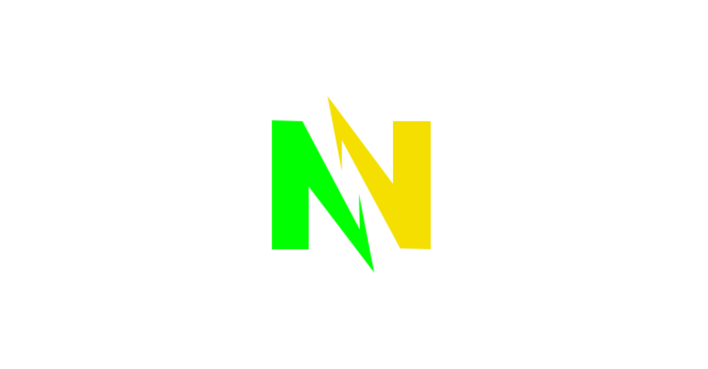

<p align="center">
  
</p>

<p align="center">
  <b>Google Drive file synchronization for Linux and Windows</b><br/>
  Simple, lightweight, and open source — a free alternative to Insync
</p>

<p align="center">
  
  
  
  
  
</p>

## 📦 Download (Release)

👉 A compiled **version is already available on GitHub Releases**.

You can download ready-to-use builds for Linux and Windows without building from source:

➡️ https://github.com/bryanrafaelbueno/synca/releases

---

## ✨ What is Synca?

**Synca** is a sync client that automatically connects your local folders to Google Drive.

It runs silently in the background (daemon), detects file changes, and keeps everything synchronized in real time.

💡 Ideal for anyone who wants something lightweight, open source, and without relying on paid solutions.

---

## 🚀 Features

- 🔄 Automatic synchronization (near real-time)
- 📂 Recursive folder monitoring
- ⚡ Low memory usage (Go + Tauri)
- 🔐 Secure Google login (OAuth2)
- 🧠 Intelligent conflict resolution
- 📡 Real-time communication (WebSocket)
- 🖥️ Lightweight native interface
- 🪟 Windows and Linux support

---

## 🧠 How it works


```

You save a file
↓
Synca detects the change
↓
Processes in background
↓
Uploads to Google Drive
↓
Interface updates automatically

```

---

## 📁 Project Structure

```

synca/
├── assets/                  # Logos and visual resources
├── bin/                     # Compiled daemon binaries
├── daemon/                  # Go backend (sync daemon)
│   ├── cmd/synca/           # CLI entrypoint
│   └── internal/            # Internal logic (watcher, sync, API)
├── desktop/                 # Desktop app (Tauri + React)
│   ├── ui/                  # React frontend (components, hooks, store)
│   ├── src-tauri/           # Tauri Rust backend (this name is required)
│   ├── index.html           # Vite entrypoint
│   ├── vite.config.ts       # Vite configuration
│   └── package.json         # Frontend dependencies
├── Makefile                 # Build, dev, and release commands
└── README.md

````

---

## 📦 Installation

### Arch Linux (AUR)

If you are using Arch Linux, you can install Synca via the AUR using a helper like `yay`:

```bash
yay -S synca-bin

or

yay -S synca
```

The bin downloads the AppImage and put on the /usr/bin/, more easy to install.

The synca one, automatically handle all dependencies, build the project from source, and set up the systemd user service.

---

### Manual Installation (From Source)

#### 1. Setup Environment
Ensure you have **Go**, **Rust**, and **Node.js** installed (see [Developer Guide](#-developer-guide--portability) for details).

```bash
git clone https://github.com/bryanrafaelbueno/synca
cd synca

# Configure credentials for development
cp .env.example .env
# Edit .env and add your GOOGLE_CLIENT_ID and GOOGLE_CLIENT_SECRET

make setup
```

#### 2. Run in Development Mode
This will build the backend and start the frontend with hot-reload enabled.

```bash
make dev
```

#### 3. Setup Synchronization
1.  **Login**: Click **"Log in to Google Drive"** in the app.
2.  **Add Folders**: Use the **"+"** button in the sidebar to select local folders you want to sync.
3.  **Monitor**: Everything will now sync automatically in the background.

---

## 🖥️ Interface


* Sync status
* File list
* Progress
* Connection state

---

## ⚙️ Configuration

File:

```
~/.config/synca/config.json
```

Example:

```json
{
  "watch_paths": ["/home/user/Documents"],
  "log_level": "info"
}
```

---

## ⚔️ File Conflicts

| Strategy   | Behavior                    |
| ---------- | --------------------------- |
| KeepBoth   | Creates copy with timestamp |
| NewerWins  | Keeps the most recent       |
| LocalWins  | Keeps the local version     |
| RemoteWins | Keeps the remote version    |

---

## 🛠️ CLI

```bash
synca daemon
synca connect google-drive
synca watch ~/folder
synca status
```

---

## 🧱 Stack

* Backend: Go
* Watcher: fsnotify (inotify)
* Frontend: Tauri + React
* State: Zustand
* Communication: WebSocket

---

## 🗺️ Roadmap

* [x] Automatic upload
* [x] Functional interface
* [x] Conflicts
* [x] System tray
* [ ] Full bidirectional sync
* [ ] Multi-cloud (Rclone)

---

## 🤝 Contributing

1. Fork the project
2. Create your Feature Branch (`git checkout -b feature/AmazingFeature`)
3. Commit your changes (`git commit -m 'Add some AmazingFeature'`)
4. Push to the Branch (`git push origin feature/AmazingFeature`)
5. Open a Pull Request

---

## 🛠️ Developer Guide & Portability

If you are setting up Synca on a new machine, follow this checklist to ensure you have everything needed to compile and run the project.

### 1. Core Prerequisites
The following compilers and runtimes must be installed on your system:
- **Go 1.22+**: [Download Go](https://go.dev/dl/)
- **Rust (Latest Stable)**: [Install Rust](https://rustup.rs/)
- **Node.js (v18+) & NPM**: [Download Node.js](https://nodejs.org/)

### 2. System Dependencies (Linux)
Tauri requires several development headers. On Ubuntu/Debian, install them with:
```bash
sudo apt update
sudo apt install libwebkit2gtk-4.1-dev build-essential curl wget file libssl-dev libgtk-3-dev libayatana-appindicator3-dev librsvg2-dev
```

### 3. Build Tools
- **Linux**: `make`, `gcc`, `pkg-config`.
- **Windows**: Use **Git Bash** (recommended) or install `make` via [Chocolatey](https://chocolatey.org/) (`choco install make`).

### 4. Cross-platform Bundling
- **Windows Setup**: To build the `.exe` installer, you need **NSIS**.
- **Windows from Linux**: Install `mingw-w64` and `nsis` (`sudo apt install nsis mingw-w64`).
- **AppImage**: Download [linuxdeploy](https://github.com/linuxdeploy/linuxdeploy) and add it to your PATH or a `tools/` folder.

---

## 🏗️ Quick Setup Checklist
1.  **Verify Environment**: Run `make check-deps` to see if anything is missing.
2.  **Install Dependencies**: Run `make setup`.
3.  **Run Dev Mode**: Run `make dev`.
4.  **Build Release**: Run `make release-linux` or `make release-windows`.

---

## 📄 License

MIT © Synca Contributors

---

## ☕ Support the project
If this project helps you, consider supporting development: </br>
<a href="https://www.buymeacoffee.com/bryanrafaelbueno" target="_blank"></a> </br>

<h2 align="center">🇧🇷 Made in Brazil 🇧🇷</h2>
